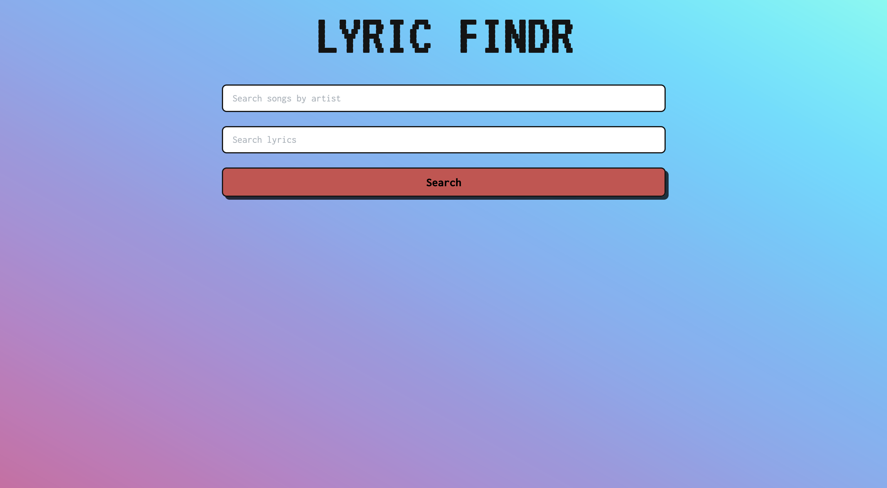

# Lyric Findr

This Flask application allows users to obtain lyrics to songs. Users can search for lyrics by providing either the artist name, the song title, or both.



## Table of Contents

- [Features](#features)
- [Installation](#installation)
- [Usage](#usage)
- [Dependencies](#dependencies)
- [Contributing](#contributing)
- [License](#license)

## Features

- **Search by Artist Name**: Users can search for lyrics by entering the name of the artist.
- **Search by Song Title**: Users can search for lyrics by entering the title of the song.
- **Search by Artist Name and Song Title**: Users can search for lyrics by entering both the artist name and the song title.
- **Error Handling**: The application provides appropriate error messages if the search parameters are not valid or if an error occurs while retrieving lyrics.

## Installation

1. Clone the repository: https://github.com/michealcoleyoung/lyrics-api.git
  
2. Navigate to the project directory:
  
  ```
  $ cd lyrics-api
  ```
  
3. Install dependencies:
  ```
  $ pip install Flask
  ```
  ```
  $ pip install azlyrics
  ```
  

## Usage

1. Run the Flask application: python app.py

2. Open your web browser and navigate to `http://127.0.0.1:5000/`.
3. Enter the artist name and/or song title in the provided input fields.
4. Click the "Search" button to obtain the lyrics.

## Dependencies

- Flask: A micro web framework for Python.
- azapi: A Python wrapper for accessing the AZLyrics API.

## Contributing

Contributions are welcome! If you'd like to contribute to this project, please fork the repository and submit a pull request with your changes.

## License

This project is licensed under the MIT License - see the [LICENSE](LICENSE) file for details.